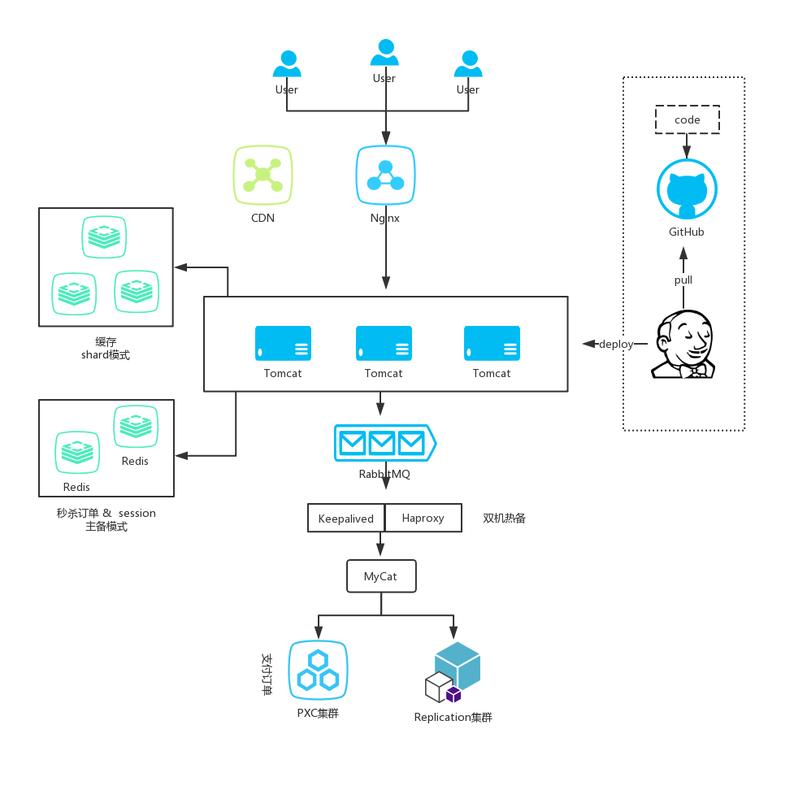

# SecKill
## 概览
基于Nginx + Tomcat集群 + Redis集群 + RabbitMQ的高并发秒杀后端

## 功能点:
- [x] 基于Docker的Nginx、Tomcat集群、多Redis集群、RabbitMQ
- [x] Scheduled + (Redis+Lua脚本 || Redisson)分布式锁实现定时关单
- [x] 哨兵Redis集群负责 Session & 秒杀订单
- [x] 其他缓存 Sharing模式
- [ ] Jenkins实现代码提交自动部署到Tomcat docker容器
- [ ] Redis集群使用一致性哈希算法
- [ ] Jmeter自动压测返回报告
- [ ] Replication数据库集群
- [ ] PXC数据库集群
- [ ] CDN网络
- [ ] HBase
- [ ] DB乐观锁
- [ ] 用户登出
- [ ] 异步下单结果通知

## 重要功能实现
### 1. 分布式Session
解决请求负载均衡到不同Tomcat服务器的session共享问题

token = 加密（userId + 加密信息）

用户下次请求，HandlerInterceptorAdapter拦截请求，从请求中拿出token, 查看Redis中是否存在，解密对比加密信息
是否一致，存在且一致则取出uid，放入ThreadLocal中。

### 2. 分布式锁
应用: 应用程序使用Scheduled定时关闭超时订单，Tomcat集群中会发生争抢执行的情况，需要使用分布式锁来协调。
- 实现1. Redis setnx|ex & lua脚本
- 实现2. Redisson可重入锁

## 一些细节思考
### 1. 对于秒杀订单的支付问题 - 数据库设计
- 将支付订单和未支付订单分开，在撤单时，不需要扫描所有订单，只需要扫描未支付订单即可；
    - 额外操作，未支付订单移入支付订单中
- 不分开，在撤单时，需要扫描所有订单，在支付时，需要update status字段

实验：
- 1000条数据插入、删除各耗时2.6s
- 1000条数据更新耗时2.4s
最终方案：不分开，设置支付字段，给status加上索引，最好是位图索引

### 2. 分布式锁总结
PlanA:
- 使用Set(key, value) ，expire()，del()命令
- 缺陷：set 和 expire之间出错，结果可能锁一直生效，所有人都无法获取到锁
- 这个大可不必要，因为实现复杂，而且redis提供了setnx|ex命令

PlanB:
- 使用Set(key, value, nx, ex, expireTime)原子指令 和 del()指令
- 缺陷：假设A设置expire  = 2, 但是业务执行了3s；2s时B设置锁；A在3s时释放锁，就释放了B设置的锁

PlanC:
- 给上一个Value中添加身份标示，释放锁时，看是否是自己加的
- 缺陷：get() del()不是原子方法，在执行间隙可能夹杂其他操作，还有可能释放掉别人的锁

PlanD:
- 使用Lua脚本使得释放锁Get & Del成为原子性
- 缺陷：单机环境下可以，在集群下主从复制异步性可能导致新的问题

参考[别人的分布式锁](https://wudashan.cn/2017/10/23/Redis-Distributed-Lock-Implement/)