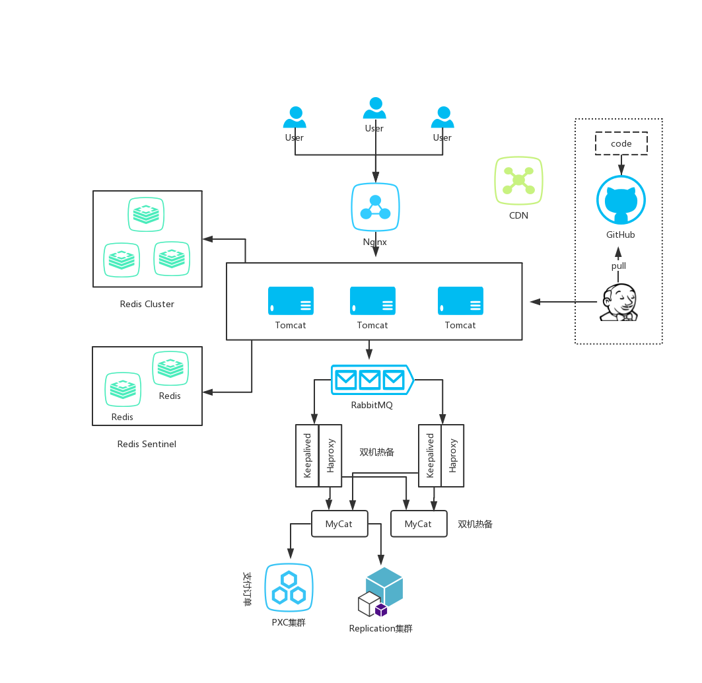

# SecKill
## 概览
基于Nginx + Tomcat集群 + Redis多集群 + RabbitMQ + PXC集群 + MySQL主从复制的高并发秒杀后端


## 集群

### Redis集群：

Sentinel模式：三个哨兵+一主二从

```
root     18628 17960  0 Jul14 ?        01:31:42 redis-sentinel *:26379 [sentinel]
root     18635 17960  0 Jul14 ?        01:31:37 redis-sentinel *:26380 [sentinel]
root     18647 17960  0 Jul14 ?        01:31:33 redis-sentinel *:26381 [sentinel]

# docker容器
88da4e131fc1        redis-sentinel-temp   "docker-entrypoint.s…"   13 days ago         Up 13 days          0.0.0.0:26379-26381->26379-26381/tcp, 0.0.0.0:6666->6379/tcp   redis-master-new
a32d2b59a8b7        redis                 "docker-entrypoint.s…"   2 weeks ago         Up 13 days          0.0.0.0:6668->6379/tcp                                         redis-slave2
70d9f6fe6400        redis                 "docker-entrypoint.s…"   2 weeks ago         Up 13 days          0.0.0.0:6667->6379/tcp                                         redis-slave1
```

Cluster模式：三主三从

```
root     18805     1  0 Jul15 ?        00:30:58 redis-server 0.0.0.0:7777 [cluster]
root     18814     1  0 Jul15 ?        00:31:05 redis-server 0.0.0.0:7778 [cluster]
root     18819     1  0 Jul15 ?        00:31:01 redis-server 0.0.0.0:7779 [cluster]
root     18829     1  0 Jul15 ?        00:38:21 redis-server 0.0.0.0:7787 [cluster]
root     18834     1  0 Jul15 ?        00:38:21 redis-server 0.0.0.0:7788 [cluster]
root     18843     1  0 Jul15 ?        00:38:13 redis-server 0.0.0.0:7789 [cluster]
```

### 数据库集群

两个PXC集群：单个PXC集群包含三个mysql

一个主从复制集群，存在单点风险

MyCat双机热备

双机Haproxy + Keepalived保证高可用

> Haproxy配置多个轮询MyCat实例
>
> Keepalived配置争抢虚拟ip

## 优化思路

### 1. 系统概述：

秒杀系统的特点是瞬时流量非常大，读多写少，而真正成功秒杀的人只是极少数。一般来说数据库层都是压死骆驼的最后一根稻草，所以我们的优化方向就是分层过滤，挡掉大多数不必要的请求，让少数请求落到数据库层面。核心是通过限流、缓存、队列来保证高并发。

> 秒杀系统在互联网公司内一般是隔离的

### 2. 优化方向

1. 请求层层过滤：将请求进行层层过滤，尽量拦截在系统上游
2. 使用缓存：秒杀是一个典型的读多写少的场景，可以充分利用缓存

### 3. 各层次优化细节

1. 客户端
   1. 对用户一定时间内的请求进行限定。可以使用按钮置灰、验证码、点击多次但只发送一次请求等方法。这对于高端玩家是拦不住的。
   2. 使用浏览器页面缓存
2. 入口层
   1. Nginx ip限流，抛弃请求，原则要保护系统
   2. Nginx缓存js, css, jpg等
   3. CDN网络
   4. 高可用，心跳Keepalived
3. 服务层
   1. Tomcat集群横向扩容
   2. 消息队列解耦削峰
   3. redis缓存（单机每秒10w并发）
   4. 内存标记. 存在分布式数据不一致问题，解决办法：1不管，内存标记生效时已经是个位数商品了；2.使用zookeeper同步
   5. 业务层不要有状态，状态要分散到缓存层和数据库
   6. 推荐缓存层和业务层混合部署，分散压力
4. 数据库
   1. 订单和支付数据的存储：用户在下单后一般会查看是否成功，如果采用主从架构，可能未同步完成，造成查询刚刚的订单失败。用户体验差不说，此时用户可能还会去请求其他数据，造成负担。所以应该采用PXC架构

## 后端业务逻辑

- 系统初始化，把商品库存数量加载到Redis
  - implements InitializingBean.afterPropertiesSet()
- 收到请求
- 从Redis拿到token，解析出用户id
- 开始执行秒杀
  - 限流防刷检查
  - 内存标记，减少redis访问
  - redis判断是否秒杀过了
  - Redis预减库存，库存不足，直接返回，否则入队
- 请求入队，立即返回排队中（入队很快，即存数据于内存）
- 请求出队，生成订单，减少库存
  - 基于数据库乐观锁
  - 生成订单成功，订单信息写入redis
  - 出错，redis返还库存
- 客户端轮询，是否秒杀成功
- 支付：
  - 超过30min未支付取消订单，返还库存

## 功能点

### 架构层

- [x] 基于Docker的Nginx
  - [x] 反向代理 + 负载均衡 + 限流
  - [ ] Nginx高可用
- [x] 基于Docker的Tomcat集群
  - [x] 优化线程连接
  - [x] 采用apr连接器
- [x] Redis高可用集群
  - [x] Redis Sentinel主从模式存储 Session & 秒杀订单
  - [x] Redis Cluster存储其他缓存
- [x] 高可用数据库集群
  - [x] PXC数据库集群 * 2 存储支付订单、商品订单数据
  - [x] 简单主从复制集群，读写分离 存储商品信息
    - [ ] 升级MHA架构
  - [x] MyCAT路由、分片、双机热备
  - [x] Haproxy分发请求给MyCAT
    - [x] 双机热备
  - [x] keepalived虚拟ip，保证高可用
- [ ] 日志收集分析，对接Kafka
- [ ] 迁移至微服务架构
- [ ] Hystrix 服务降级
- [ ] 系统临时扩容
- [ ] 动静分离，静态数据（js, css, jpg）从CDN \ Ngnix \ Redis获取；动态数据从Tomcat集群获取
- [ ] LVS四层负载均衡

### 业务逻辑

- [x] Scheduled + (Redis+Lua脚本 || Redisson)分布式锁实现定时关单
- [x] 限流

### 数据库

- [x] 数据库乐观锁: 适合读多写少，提高系统吞吐
- [ ] 数据库主键snowflake算法
- [ ] HBase分布式文件存储
- [ ] sql优化，执行计划
- [ ] druid数据监控，sql调优

### 代码层

- [x] 全局异常处理器
- [ ] 异步下单结果通知
- [ ] 秒杀接口地址隐藏，防止恶意调用秒杀接口
- [ ] 秒杀验证码
- [ ] 异步流程内存标记的还原
  - [ ] zookeeper

### CI/CD

- [ ] Jenkins实现代码提交自动部署到Tomcat docker容器
- [ ] Jmeter自动压测返回报告
- [ ] Docker Compose一键部署

### 其他

- [ ] CDN网络
- [ ] linux句柄数调节
- [ ] 考虑缓存击穿等问题
- [ ] 监控
- [ ] 反作弊
- [ ] 秒杀业务如何不影响正常业务

## 重要功能的思考

### 1. 系统高可用

支撑7*24服务

- nginx -> keepalived
- tomcat -> 集群
- redis -> 哨兵模式 + sharding模式
- mysql -> 主备集群 + PXC集群

### 2. 分布式Session

解决请求负载均衡到不同Tomcat服务器的session共享问题

token = 加密（userId + 加密信息）

用户下次请求，HandlerInterceptorAdapter拦截请求，从请求中拿出token, 查看Redis中是否存在，解密对比加密信息是否一致，存在且一致则取出uid，放入ThreadLocal中。

> 也可以使用分布式session来实现，对代码的侵入性更低

### 3. 分布式锁

在多线程中加锁是`线程`对`进程资源`的分配，分布式锁是控制`单个服务器`（`进程`）对`集群`中**共有资源**的分配

应用: 应用程序使用Scheduled定时关闭超时订单，Tomcat集群中会发生争抢执行的情况，需要使用分布式锁来协调。

- 实现1. Redis setnx|ex & lua脚本
- 实现2. Redisson可重入锁

#### Redisson介绍

https://redisson.org

https://github.com/redisson/redisson/wiki


#### Redis分布式锁总结
[参见我的个人博客中对Redis分布式锁的分析](http://will-johnson.gitee.io/blog/2019/08/11/Redis%E5%88%86%E5%B8%83%E5%BC%8F%E9%94%81/)

### 4. 限流

#### A. nginx limit_req, ip限流

```sh
# limit access
limit_req_zone $binary_remote_addr zone=perip:50m rate=1r/s;    # 不能超过每秒1次, 保存IP的缓存为50M；16000个IP地址的状态信息约1MB
limit_conn_zone $server_name zone=perserver:10m rate=2r/s;        # $server_name 要限流的域名

server {
    listen       80;
    server_name  localhost;

    # limit access
    limit_req zone=perip burst=5 nodelay; # 如果每秒超过10次但超过的请求数量小于等于5(burst=50)时，会延迟请求。如果超过每秒的请求数超过5，则立即返回503
    limit_req zone=perserver burst=5 nodelay; 
```

#### B. 分布式Redis限流

Redis存储用户<id+uri, request_times>，代码层采用自定义注解对接口进行限流。

#### C. 令牌桶算法等的限流

### 5. 数据库乐观锁

#### A. 基于状态

```sql
update goods set stock = stock - #{buy} where id = #{id} and stock >0
```

发现冲突一般做法是休息一段随机时间后自动重试，二般是让用户决定 

#### B. 基于版本号

```sql
update goods set stock = stock - #{buy}, version = #{version} +1 where id = #{id} and version = #{version}
```

#### C. Redis watch乐观锁[待实现]

## 性能优化

电脑配置：4核8G

### 1. Tomcat线程池调整

```
粗略估算得：
cpu耗时：11ms
IO耗时：65ms

最优线程池大小 =  ( (线程io时间 + 线程cpu) / 线程cpu time) * cpu核数
(60+11)/11 * 4 = 27.6个

压测得最优线程池大小23个
```

使用apr连接器：qps性能提升约4%


### 2. GC调优

秒杀场景特点：大多是新对象，生命周期很短

5000线程+30次循环


我先后用了CMS+ParNew, G1两种垃圾回收器进行压测

- CMS+ParNew
    - 默认参数
        - qps: 700
    - 设置初始堆大小700MB，新生代200M
        - qps: 870
- G1
    - 默认参数
        - qps: 1060
    - 设置初始堆大小700M
        - qps: 1200

对比之下，CMS在秒杀过程中有明显的停顿

关于G1的优势，详见[G1](http://will-johnson.gitee.io/blog/2019/07/02/G1/)


## 一些细节思考

### 1. 对于秒杀订单的支付问题 - 数据库设计

- 将支付订单和未支付订单分开，在撤单时，不需要扫描所有订单，只需要扫描未支付订单即可；
  - 额外操作，未支付订单移入支付订单中
- 不分开，在撤单时，需要扫描所有订单，在支付时，需要update status字段

实验：

- 1000条数据插入、删除各耗时2.6s
- 1000条数据更新耗时2.4s
  最终方案：不分开，设置支付字段，给status加上索引，最好是位图索引

### 3. 分布式调度

现有的分布式调度是集群自己调度自己，使用分布式锁来实现。

另一种分布式调度可以是集群外的集群选中唯一的一台去执行任务，这样也是分布式调度。比如美团的Crane

### 4. 分布式问题

分布式会带来更强的性能，高可用

但是也会产生许多问题，比如：

- 分布式事务

- Session管理

- 分布式缓存

- 分布式扩缩容

- 单点故障

- 延时 跨机房网络传输

- 数据分片

- 分布式任务调度

- 数据一致性